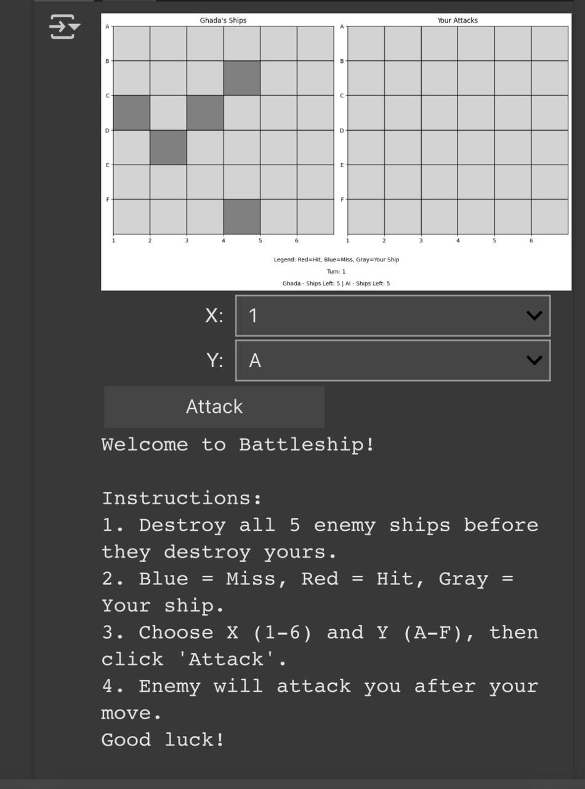
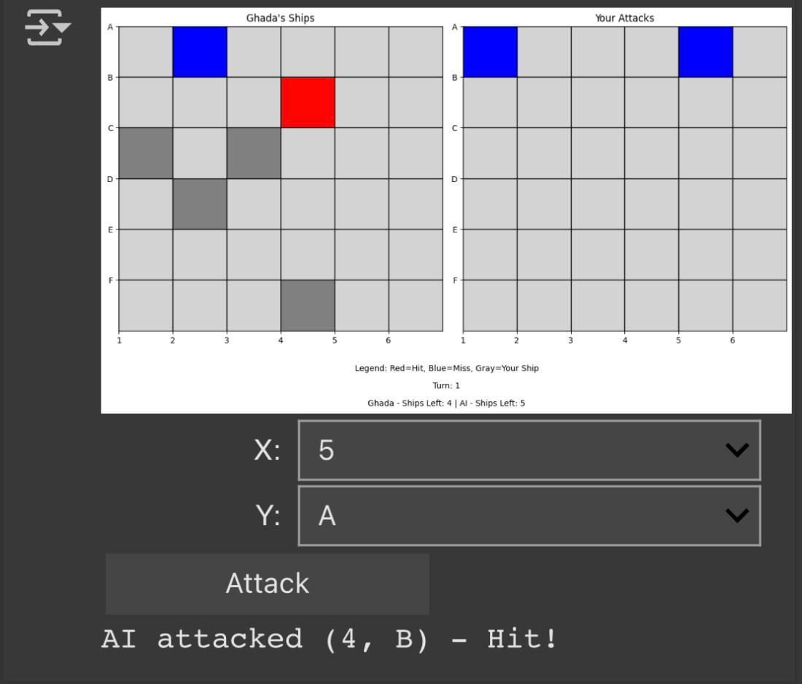
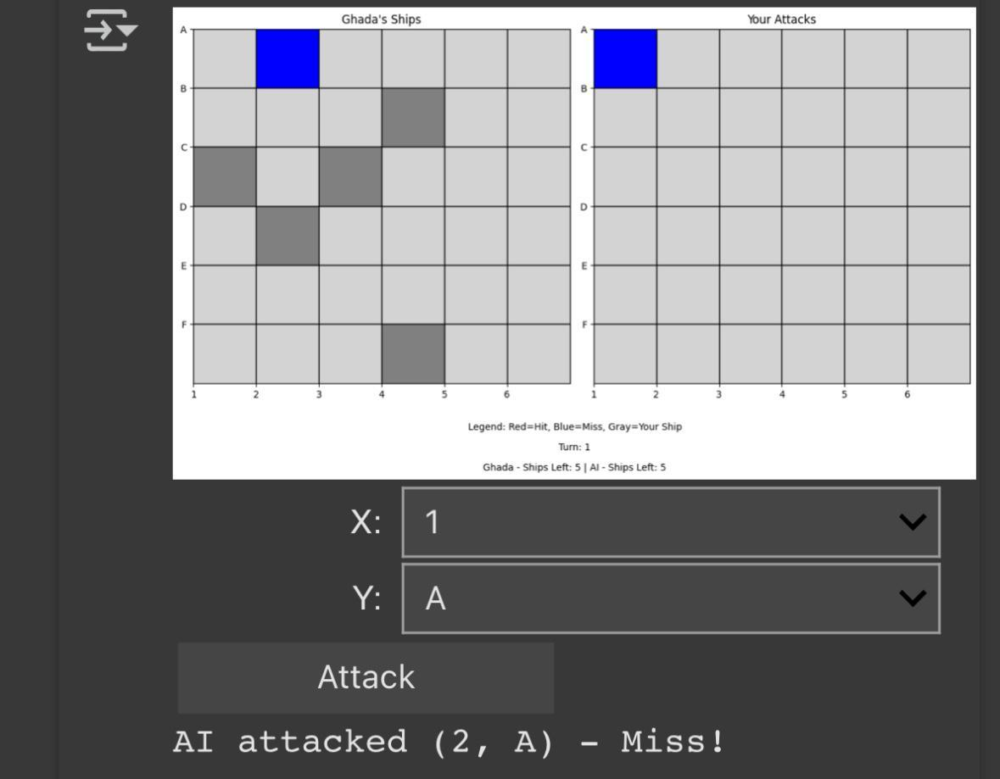
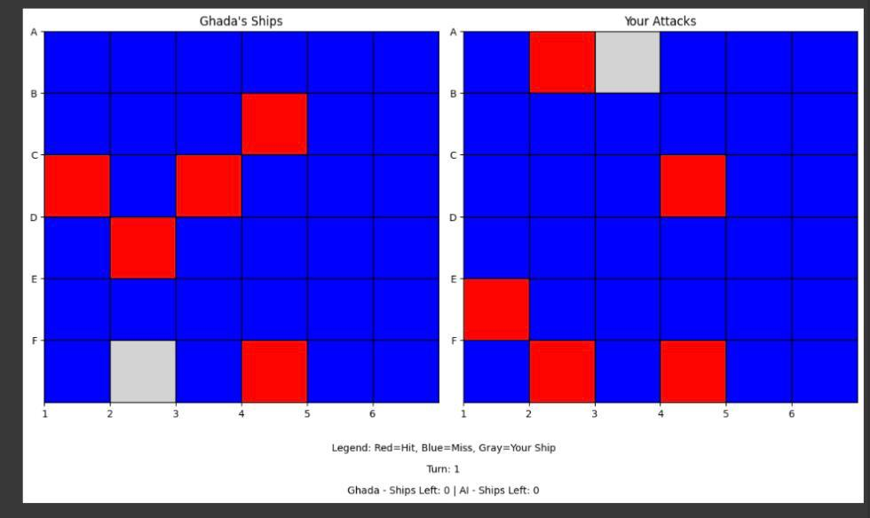

# Battleship Game with a Minimax AI Opponent

An interactive Battleship game built in Python, featuring an AI opponent powered by the **Minimax algorithm** via the **easyAI** library. Developed as the final project for EMAI-611: Advanced Programming for AI at King Abdulaziz University.

Status: Course Project | Python 3.x | AI: easyAI (Minimax) | Environment: Google Colab

---

## Overview

Battleship is a classic two-player strategy game where each player hides a fleet of ships on a grid and takes turns guessing the opponent's ship locations. This project brings a human player up against an AI opponent that uses the **Minimax algorithm** to make optimal, strategic moves — demonstrating a classical adversarial-search approach to game AI, distinct from deep-learning-based decision making.

---

## Key Features

- 6x6 grid (columns A–F, rows 1–6)
- Two game modes: Human vs. AI, and Human vs. Human
- AI opponent powered by easyAI's `AI_Player` and the Minimax algorithm
- Turn-based gameplay with hit ('O') / miss ('X') feedback printed after every move
- Randomized ship placement for fair play
- Input validation for invalid or repeated moves
- Win/loss detection once all of a player's ships are sunk
- A follow-up graphical interface (GUI) prototype with color-coded boards (red = hit, blue = miss, gray = your ship), dropdown coordinate selection, and live game-state tracking

---

## Tech Stack

| Category | Tools / Libraries |
|---|---|
| Language | Python 3.x |
| AI Algorithm | Minimax (via `easyAI`'s `AI_Player` and `TwoPlayersGame`) |
| Environment | Google Colab / Jupyter Notebook |
| GUI Prototype | Interactive widget-based interface with dropdown controls and color-coded boards |

---

## How It Works

1. **Game Setup** — Ships (sizes 2 and 3 units) are randomly placed on each player's 6x6 board.
2. **Game Loop** — The custom `BattleshipGame` class extends easyAI's `TwoPlayersGame`, handling turn order, move validation, and board updates.
3. **AI Decision-Making** — The AI opponent evaluates the game state via `possible_moves()` and selects moves using the Minimax algorithm through `make_move()`.
4. **Feedback & End State** — After each turn, the board is reprinted showing hits and misses; the game ends when one player's entire fleet is sunk.

---

## Demo

  
  

**Left:** The GUI welcome screen with instructions and coordinate dropdowns (X: 1–6, Y: A–F) to select an attack.
**Right:** A successful hit — the AI attacked (4, B) and the board updates live, tracking ships remaining for both sides.

  
  

**Left:** A missed attack example — the board reflects the miss and the game continues.
**Right:** End of game — both fleets fully revealed, showing every hit (red), miss (blue), and remaining ship (gray) across the full match.

---

## Challenges

- Adapting `easyAI` (originally designed for games like Tic-Tac-Toe) to fit Battleship's unique game flow
- Managing dynamic grid updates and tracking multiple ship positions simultaneously
- Ensuring fair, randomized AI ship placement and legal move generation
- Validating user input for coordinate guesses

---

## Future Work

- Full graphical interface using Tkinter or PyGame
- Custom ship placement by the user
- Multiplayer support over a local network or the internet
- Smarter AI that adapts to player guessing patterns

---

## Team

This was a group project for the EMAI-611 course at King Abdulaziz University:
- **Ghada Alsulami**
- **Raseel Alghamdi**

---

## References

- Zulko, easyAI documentation: https://zulko.github.io/easyAI/
- Python Official Docs: https://docs.python.org/3/
- EMAI-611 Course Slides
- *AI Game Programming Patterns* by Robert Nystrom

---

## Author (this repository)

**Ghada Alsulami**
Email: gabdullh84@gmail.com
GitHub: [@Gadah12](https://github.com/Gadah12)
